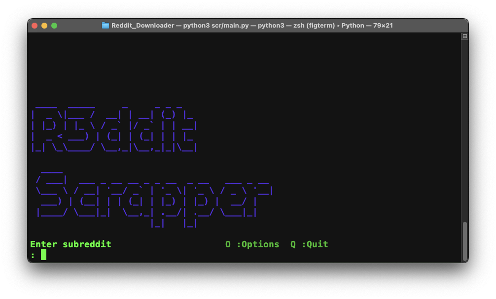

<div id="top"></div>
<!--

<!-- PROJECT LOGO -->
<br />
<div align="center">
  <a href="https://github.com/Baccount/Reddit_Downloader/tree/master">
    
  </a>

<h3 align="center">R3ddit Scrapper</h3>

  <p align="center">
     Download images from Reddit in bulk with ease!
    <br />
    <a href="https://github.com/Baccount/Reddit_Downloader/tree/master"><strong>Explore the docs »</strong></a>
    <br />
    <br />
    <a href="https://github.com/Baccount/Reddit_Downloader/tree/master">View Demo</a>
    ·
    <a href="https://github.com/Baccount/Reddit_Downloader/tree/master/issues">Report Bug</a>
    ·
    <a href="https://github.com/Baccount/Reddit_Downloader/tree/master/issues">Request Feature</a>
  </p>
</div>

<!-- TABLE OF CONTENTS -->
<details>
  <summary>Table of Contents</summary>
  <ol>
    <li>
      <a href="#about-the-project">About The Project</a>
    </li>
    <li>
      <a href="#installation">Installation</a>
    </li>
    <li><a href="#usage">Usage</a></li>
    <li><a href="#contributing">Contributing</a></li>
    <li><a href="#license">License</a></li>
    <li><a href="#contact">Contact</a></li>
    <li><a href="#acknowledgments">Acknowledgments</a></li>
  </ol>
</details>

<!-- ABOUT THE PROJECT -->

## About The Project


<p align="right">(<a href="#top">back to top</a>)</p>

### Installation

First install the following:

- <https://apps.apple.com/us/app/dynamic-wallpaper-engine/id1453504509?mt=12>

- Step 1

  ```sh
  git clone https://github.com/Baccount/Reddit_Downloader.git
  ```

- Step 2

  ```sh
  cd Reddit_Downloader/
  ```

- Step 3

  ```sh
  pip3 install -r requirements.txt
  ```

<p align="right">(<a href="#top">back to top</a>)</p>

<!-- USAGE EXAMPLES -->

## Usage

## Parsing the arguments passed by the user.
Optional arguments:\
-s --sub: The subreddit you want to download from\
-l --limit: number of images to download\
-o --order: hot, top, new\
-n --nsfw: False = NO NSFW images\
-p --path: The path you want to save to


<p align="right">(<a href="#top">back to top</a>)</p>

<!-- CONTRIBUTING -->

## Contributing

Contributions are what make the open source community such an amazing place to learn, inspire, and create. Any contributions you make are **greatly appreciated**.

If you have a suggestion that would make this better, please fork the repo and create a pull request. You can also simply open an issue with the tag "enhancement".
Don't forget to give the project a star! Thanks again!

1. Fork the Project
2. Create your Feature Branch (`git checkout -b feature/AwesomeFeature`)
3. Commit your Changes (`git commit -m 'Add some AwesomeFeature'`)
4. Push to the Branch (`git push origin feature/AwesomeFeature`)
5. Open a Pull Request

<p align="right">(<a href="#top">back to top</a>)</p>

<!-- LICENSE -->

## License

Distributed under the MIT License. See `LICENSE.txt` for more information.

<p align="right">(<a href="#top">back to top</a>)</p>

<!-- CONTACT -->

## Contact

Twitter - [@BaccountGit](https://twitter.com/BaccountGit) - Email - turns.spread_0m@icloud.com

Project Link: [https://github.com/github_username/repo_name](https://github.com/github_username/repo_name)

<p align="right">(<a href="#top">back to top</a>)</p>

<!-- ACKNOWLEDGMENTS -->

## Acknowledgments

- [praw](https://praw.readthedocs.io/en/stable/index.html)
- [pyfiglet](https://github.com/pwaller/pyfiglet)
- [Best-README-Template](https://github.com/othneildrew/Best-README-Template)

<p align="right">(<a href="#top">back to top</a>)</p>
